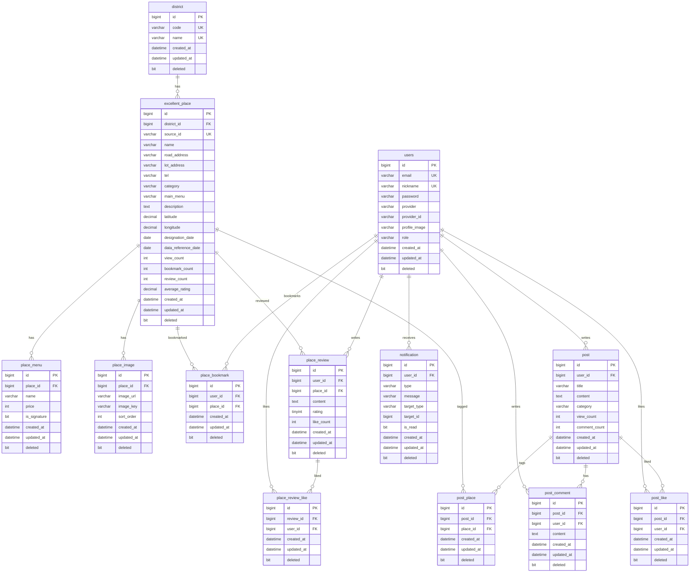

# EatBusan DB TABLE 및 ERD

이 문서는 부산광역시 구/군별 모범음식점 조회, 커뮤니티 게시판, 마이페이지 기능을 기준으로 한 초기 DB 설계안이다. 참고 프로젝트(`2025-pick-eat`)와 동일하게 주요 도메인 테이블은 `id`, `created_at`, `updated_at`, `deleted` 공통 컬럼을 둔다.

## 1. 전체 관계 요약

```text
users
  ├─ post
  │   ├─ post_comment
  │   ├─ post_like
  │   └─ post_place
  ├─ post_comment
  ├─ place_bookmark
  ├─ place_review
  └─ place_review_like

district
  └─ excellent_place
       ├─ place_menu
       ├─ place_image
       ├─ place_bookmark
       ├─ place_review
       └─ post_place

place_review
  └─ place_review_like
```

핵심 관계:

- `district`는 부산광역시 16개 구/군 기준 테이블이다.
- `excellent_place`는 지역구별 모범음식점 원천 데이터를 저장한다.
- `place_menu`, `place_image`는 모범음식점의 메뉴와 이미지 확장 테이블이다.
- `post`는 커뮤니티 게시물이다.
- `post_comment`는 게시물 댓글이며 대댓글은 지원하지 않는다.
- `post_like`는 사용자별 게시물 좋아요 중복을 막는다.
- `place_bookmark`와 `place_review`는 마이페이지에서 내가 저장한 식당/작성한 리뷰 조회에 사용한다.
- `post_place`는 게시글에서 식당을 태그하거나 추천할 때 사용한다.

## 2. 공통 컬럼 규칙

대부분의 서비스 테이블은 다음 컬럼을 가진다.

```text
id          bigint       PK, auto_increment
created_at  datetime(6)  NOT NULL
updated_at  datetime(6)  NOT NULL
deleted     bit(1)       NOT NULL DEFAULT b'0'
```

삭제는 물리 삭제보다 `deleted = b'1'` 처리하는 소프트 삭제를 기본으로 한다.

## 3. district

부산광역시 구/군 테이블.

```text
+------------+--------------+------+-----+---------+----------------+
| Field      | Type         | Null | Key | Default | Extra          |
+------------+--------------+------+-----+---------+----------------+
| id         | bigint       | NO   | PRI | NULL    | auto_increment |
| created_at | datetime(6)  | NO   |     | NULL    |                |
| updated_at | datetime(6)  | NO   |     | NULL    |                |
| deleted    | bit(1)       | NO   |     | b'0'    |                |
| code       | varchar(30)  | NO   | UNI | NULL    |                |
| name       | varchar(50)  | NO   | UNI | NULL    |                |
+------------+--------------+------+-----+---------+----------------+
```

예시 데이터:

- `JUNG`, `중구`
- `SEO`, `서구`
- `DONG`, `동구`
- `YEONGDO`, `영도구`
- `BUSANJIN`, `부산진구`
- `DONGNAE`, `동래구`
- `NAM`, `남구`
- `BUK`, `북구`
- `HAEUNDAE`, `해운대구`
- `SAHA`, `사하구`
- `GEUMJEONG`, `금정구`
- `GANGSEO`, `강서구`
- `YEONJE`, `연제구`
- `SUYEONG`, `수영구`
- `SASANG`, `사상구`
- `GIJANG`, `기장군`

## 4. excellent_place

부산광역시 모범음식점 기본 정보 테이블.

```text
+----------------------+---------------+------+-----+---------+----------------+
| Field                | Type          | Null | Key | Default | Extra          |
+----------------------+---------------+------+-----+---------+----------------+
| id                   | bigint        | NO   | PRI | NULL    | auto_increment |
| created_at           | datetime(6)   | NO   |     | NULL    |                |
| updated_at           | datetime(6)   | NO   |     | NULL    |                |
| deleted              | bit(1)        | NO   | MUL | b'0'    |                |
| district_id          | bigint        | NO   | MUL | NULL    |                |
| source_id            | varchar(100)  | YES  | UNI | NULL    |                |
| name                 | varchar(255)  | NO   | MUL | NULL    |                |
| road_address         | varchar(255)  | NO   | MUL | NULL    |                |
| lot_address          | varchar(255)  | YES  |     | NULL    |                |
| tel                  | varchar(50)   | YES  |     | NULL    |                |
| category             | varchar(100)  | YES  | MUL | NULL    |                |
| main_menu            | varchar(255)  | YES  |     | NULL    |                |
| description          | text          | YES  |     | NULL    |                |
| latitude             | decimal(10,7) | YES  |     | NULL    |                |
| longitude            | decimal(10,7) | YES  |     | NULL    |                |
| designation_date     | date          | YES  |     | NULL    |                |
| data_reference_date  | date          | YES  |     | NULL    |                |
| view_count           | int           | NO   |     | 0       |                |
| bookmark_count       | int           | NO   |     | 0       |                |
| review_count         | int           | NO   |     | 0       |                |
| average_rating       | decimal(2,1)  | NO   |     | 0.0     |                |
+----------------------+---------------+------+-----+---------+----------------+
```

관계:

- `district_id -> district.id`

제약/인덱스:

- `source_id` unique nullable: 공공데이터 원본 식별자가 있을 때 중복 적재 방지
- `idx_place_district_deleted(district_id, deleted)`
- `idx_place_category_deleted(category, deleted)`
- `idx_place_name(name)`
- `idx_place_address(road_address)`

## 5. place_menu

식당별 메뉴 테이블. 원천 데이터의 `menu`가 여러 메뉴를 한 문자열로 제공되는 경우 파싱 후 저장하거나, 대표 메뉴만 `excellent_place.main_menu`에 두고 상세 메뉴를 여기에 추가한다.

```text
+---------------+--------------+------+-----+---------+----------------+
| Field         | Type         | Null | Key | Default | Extra          |
+---------------+--------------+------+-----+---------+----------------+
| id            | bigint       | NO   | PRI | NULL    | auto_increment |
| created_at    | datetime(6)  | NO   |     | NULL    |                |
| updated_at    | datetime(6)  | NO   |     | NULL    |                |
| deleted       | bit(1)       | NO   |     | b'0'    |                |
| place_id | bigint       | NO   | MUL | NULL    |                |
| name          | varchar(255) | NO   |     | NULL    |                |
| price         | int          | YES  |     | NULL    |                |
| is_signature  | bit(1)       | NO   |     | b'0'    |                |
+---------------+--------------+------+-----+---------+----------------+
```

관계:

- `place_id -> excellent_place.id`

## 6. place_image

식당 이미지 테이블.

```text
+---------------+--------------+------+-----+---------+----------------+
| Field         | Type         | Null | Key | Default | Extra          |
+---------------+--------------+------+-----+---------+----------------+
| id            | bigint       | NO   | PRI | NULL    | auto_increment |
| created_at    | datetime(6)  | NO   |     | NULL    |                |
| updated_at    | datetime(6)  | NO   |     | NULL    |                |
| deleted       | bit(1)       | NO   |     | b'0'    |                |
| place_id | bigint       | NO   | MUL | NULL    |                |
| image_url     | varchar(500) | NO   |     | NULL    |                |
| image_key     | varchar(255) | YES  |     | NULL    |                |
| sort_order    | int          | NO   |     | 0       |                |
+---------------+--------------+------+-----+---------+----------------+
```

## 7. users

로그인 사용자 테이블.

```text
+----------------+--------------+------+-----+---------+----------------+
| Field          | Type         | Null | Key | Default | Extra          |
+----------------+--------------+------+-----+---------+----------------+
| id             | bigint       | NO   | PRI | NULL    | auto_increment |
| created_at     | datetime(6)  | NO   |     | NULL    |                |
| updated_at     | datetime(6)  | NO   |     | NULL    |                |
| deleted        | bit(1)       | NO   | MUL | b'0'    |                |
| email          | varchar(255) | NO   | UNI | NULL    |                |
| nickname       | varchar(50)  | NO   | UNI | NULL    |                |
| password       | varchar(255) | YES  |     | NULL    |                |
| provider       | varchar(30)  | NO   | MUL | LOCAL   |                |
| provider_id    | varchar(100) | YES  | MUL | NULL    |                |
| profile_image  | varchar(500) | YES  |     | NULL    |                |
| role           | varchar(30)  | NO   |     | USER    |                |
+----------------+--------------+------+-----+---------+----------------+
```

제약:

- `email` unique
- `nickname` unique
- `(provider, provider_id)` unique. 단, `provider_id`가 `NULL`인 로컬 계정은 DBMS별 unique nullable 정책을 고려한다.

## 8. post

커뮤니티 게시물 테이블.

```text
+---------------+--------------+------+-----+---------+----------------+
| Field         | Type         | Null | Key | Default | Extra          |
+---------------+--------------+------+-----+---------+----------------+
| id            | bigint       | NO   | PRI | NULL    | auto_increment |
| created_at    | datetime(6)  | NO   |     | NULL    |                |
| updated_at    | datetime(6)  | NO   |     | NULL    |                |
| deleted       | bit(1)       | NO   | MUL | b'0'    |                |
| user_id       | bigint       | NO   | MUL | NULL    |                |
| title         | varchar(200) | NO   | MUL | NULL    |                |
| content       | text         | NO   |     | NULL    |                |
| category      | varchar(30)  | NO   | MUL | GENERAL |                |
| view_count    | int          | NO   |     | 0       |                |
| comment_count | int          | NO   |     | 0       |                |
+---------------+--------------+------+-----+---------+----------------+
```

카테고리 예시:

- `GENERAL`: 자유글
- `RECOMMEND`: 식당 추천
- `REVIEW`: 방문 후기
- `NOTICE`: 공지

관계:

- `user_id -> users.id`

## 9. post_comment

게시물 댓글 테이블. 대댓글은 요구사항에서 제외되어 자기참조 `parent_id`를 두지 않는다.

```text
+------------+-------------+------+-----+---------+----------------+
| Field      | Type        | Null | Key | Default | Extra          |
+------------+-------------+------+-----+---------+----------------+
| id         | bigint      | NO   | PRI | NULL    | auto_increment |
| created_at | datetime(6) | NO   |     | NULL    |                |
| updated_at | datetime(6) | NO   |     | NULL    |                |
| deleted    | bit(1)      | NO   | MUL | b'0'    |                |
| post_id    | bigint      | NO   | MUL | NULL    |                |
| user_id    | bigint      | NO   | MUL | NULL    |                |
| content    | text        | NO   |     | NULL    |                |
+------------+-------------+------+-----+---------+----------------+
```

관계:

- `post_id -> post.id`
- `user_id -> users.id`

## 10. post_like

게시물 좋아요 테이블.

```text
+------------+-------------+------+-----+---------+----------------+
| Field      | Type        | Null | Key | Default | Extra          |
+------------+-------------+------+-----+---------+----------------+
| id         | bigint      | NO   | PRI | NULL    | auto_increment |
| created_at | datetime(6) | NO   |     | NULL    |                |
| updated_at | datetime(6) | NO   |     | NULL    |                |
| deleted    | bit(1)      | NO   | MUL | b'0'    |                |
| post_id    | bigint      | NO   | MUL | NULL    |                |
| user_id    | bigint      | NO   | MUL | NULL    |                |
+------------+-------------+------+-----+---------+----------------+
```

제약:

- `(post_id, user_id)` unique

역할:

- 사용자 1명이 게시물 1개에 좋아요를 1번만 누를 수 있게 한다.
- 좋아요 수는 Redis `SCARD`로 조회하고, Redis 장애 시 `post_like`를 `COUNT`한다.

## 11. post_place

게시물과 식당 연결 테이블. 식당 추천글/방문 후기에서 식당을 태그하기 위해 사용한다.

```text
+---------------+-------------+------+-----+---------+----------------+
| Field         | Type        | Null | Key | Default | Extra          |
+---------------+-------------+------+-----+---------+----------------+
| id            | bigint      | NO   | PRI | NULL    | auto_increment |
| created_at    | datetime(6) | NO   |     | NULL    |                |
| updated_at    | datetime(6) | NO   |     | NULL    |                |
| deleted       | bit(1)      | NO   |     | b'0'    |                |
| post_id       | bigint      | NO   | MUL | NULL    |                |
| place_id | bigint      | NO   | MUL | NULL    |                |
+---------------+-------------+------+-----+---------+----------------+
```

제약:

- `(post_id, place_id)` unique

## 12. place_bookmark

사용자가 저장한 모범음식점 테이블. 마이페이지의 찜한 식당 목록에서 사용한다.

```text
+---------------+-------------+------+-----+---------+----------------+
| Field         | Type        | Null | Key | Default | Extra          |
+---------------+-------------+------+-----+---------+----------------+
| id            | bigint      | NO   | PRI | NULL    | auto_increment |
| created_at    | datetime(6) | NO   |     | NULL    |                |
| updated_at    | datetime(6) | NO   |     | NULL    |                |
| deleted       | bit(1)      | NO   | MUL | b'0'    |                |
| user_id       | bigint      | NO   | MUL | NULL    |                |
| place_id | bigint      | NO   | MUL | NULL    |                |
+---------------+-------------+------+-----+---------+----------------+
```

제약:

- `(user_id, place_id)` unique

## 13. place_review

모범음식점 방문 리뷰 테이블.

```text
+---------------+--------------+------+-----+---------+----------------+
| Field         | Type         | Null | Key | Default | Extra          |
+---------------+--------------+------+-----+---------+----------------+
| id            | bigint       | NO   | PRI | NULL    | auto_increment |
| created_at    | datetime(6)  | NO   |     | NULL    |                |
| updated_at    | datetime(6)  | NO   |     | NULL    |                |
| deleted       | bit(1)       | NO   | MUL | b'0'    |                |
| user_id       | bigint       | NO   | MUL | NULL    |                |
| place_id | bigint       | NO   | MUL | NULL    |                |
| content       | text         | NO   |     | NULL    |                |
| rating        | tinyint      | NO   |     | NULL    |                |
| like_count    | int          | NO   |     | 0       |                |
+---------------+--------------+------+-----+---------+----------------+
```

제약:

- `rating`은 1~5 범위

## 14. place_review_like

리뷰 좋아요 테이블.

```text
+-----------+-------------+------+-----+---------+----------------+
| Field     | Type        | Null | Key | Default | Extra          |
+-----------+-------------+------+-----+---------+----------------+
| id        | bigint      | NO   | PRI | NULL    | auto_increment |
| created_at| datetime(6) | NO   |     | NULL    |                |
| updated_at| datetime(6) | NO   |     | NULL    |                |
| deleted   | bit(1)      | NO   | MUL | b'0'    |                |
| review_id | bigint      | NO   | MUL | NULL    |                |
| user_id   | bigint      | NO   | MUL | NULL    |                |
+-----------+-------------+------+-----+---------+----------------+
```

제약:

- `(review_id, user_id)` unique

## 15. notification

마이페이지 알림/활동 내역 확장을 위한 선택 테이블. 게시글 댓글, 좋아요 같은 이벤트를 기록할 수 있다.

```text
+-------------+--------------+------+-----+---------+----------------+
| Field       | Type         | Null | Key | Default | Extra          |
+-------------+--------------+------+-----+---------+----------------+
| id          | bigint       | NO   | PRI | NULL    | auto_increment |
| created_at  | datetime(6)  | NO   |     | NULL    |                |
| updated_at  | datetime(6)  | NO   |     | NULL    |                |
| deleted     | bit(1)       | NO   | MUL | b'0'    |                |
| user_id     | bigint       | NO   | MUL | NULL    |                |
| type        | varchar(30)  | NO   | MUL | NULL    |                |
| message     | varchar(255) | NO   |     | NULL    |                |
| target_type | varchar(30)  | YES  |     | NULL    |                |
| target_id   | bigint       | YES  |     | NULL    |                |
| is_read     | bit(1)       | NO   |     | b'0'    |                |
+-------------+--------------+------+-----+---------+----------------+
```

## 16. 기능 기준 테이블 묶음

### 지역구별 모범음식점

- `district`
- `excellent_place`
- `place_menu`
- `place_image`

### 커뮤니티 게시판

- `post`
- `post_comment`
- `post_like`
- `post_place`

### 마이페이지

- `users`
- `place_bookmark`
- `place_review`
- `place_review_like`
- `notification`

마이페이지 조회 예시:

- 내 프로필: `users`
- 내가 쓴 게시글: `post where user_id = ? and deleted = b'0'`
- 내가 쓴 댓글: `post_comment where user_id = ? and deleted = b'0'`
- 좋아요한 게시글: `post_like -> post`
- 찜한 식당: `place_bookmark -> excellent_place`
- 내가 쓴 리뷰: `place_review -> excellent_place`

## 17. ERD



## 18. 구현 우선순위

1. `district`, `excellent_place`를 먼저 구현해서 구/군별 리스트 API를 만든다.
2. `users` 인증/인가 방식을 확정한 뒤 커뮤니티 작성자 관계를 연결한다.
3. `post`, `post_comment`, `post_like`로 게시판 기본 기능을 구현한다.
4. `place_bookmark`, `place_review`를 추가해 마이페이지 조회 범위를 넓힌다.
5. 이미지 업로드가 필요한 시점에 `place_image`와 프로필 이미지 저장 정책을 확정한다.
