# Redis Set 기반 게시글 좋아요: 현재 코드 흐름 이해하기

## 0. 이 문서의 목적

이 문서는 현재 구현된 게시글 좋아요 기능을 팀원이 빠르게 이해하기 위한 설명서다.

현재 코드는 Redis에 좋아요 **개수만** 저장하지 않는다. 게시글별로 좋아요를 누른 회원 ID를
Redis Set에 저장하고, DB에도 같은 상태를 반영한다.

```text
DB          = 원본 데이터(Source of Truth)
Redis Set   = 좋아요 여부 조회 캐시 + 개수 조회 캐시 + 원자적 토글 처리 수단
```

Redis가 비어 있으면 DB 데이터를 기준으로 Redis Set을 다시 만드는 Lazy Bootstrap 방식을 사용한다.

---

## 1. 먼저 알아야 할 용어

| 용어 | 의미 |
| --- | --- |
| Redis Set | 중복을 허용하지 않는 값의 집합 |
| `SADD` | Set에 값을 추가 |
| `SREM` | Set에서 값을 제거 |
| `SISMEMBER` | Set에 값이 존재하는지 확인 |
| `SCARD` | Set의 원소 개수 조회 |
| Lua Script | 여러 Redis 명령을 하나의 원자적 작업으로 실행 |
| Bootstrap | Redis 캐시가 없을 때 DB 데이터를 Redis에 최초 적재 |
| Lazy Bootstrap | 서버 시작 시 전체 데이터를 적재하지 않고, 요청이 들어온 게시글부터 적재 |
| TTL | Redis Key가 자동 삭제되기까지 남은 시간 |
| Fallback | Redis 장애 시 DB만 사용해 기능을 처리하는 예비 경로 |
| Compensation | Redis 반영 후 DB 저장 실패 시 Redis 변경을 되돌리는 보상 처리 |

---

## 2. 왜 Redis Set을 사용했는가

게시글 10번에 회원 1, 3, 7이 좋아요를 눌렀다고 가정한다.

```text
post:likes:10 = {1, 3, 7}
```

Redis Set 하나로 다음 정보를 모두 얻을 수 있다.

| 필요한 정보 | Redis 명령 | 예시 결과 |
| --- | --- | --- |
| 회원 3이 좋아요를 눌렀는가 | `SISMEMBER post:likes:10 3` | `1` |
| 회원 9가 좋아요를 눌렀는가 | `SISMEMBER post:likes:10 9` | `0` |
| 현재 좋아요 수 | `SCARD post:likes:10` | `3` |
| 회원 9의 좋아요 추가 | `SADD post:likes:10 9` | Set에 `9` 추가 |
| 회원 3의 좋아요 취소 | `SREM post:likes:10 3` | Set에서 `3` 제거 |

단순히 개수만 캐싱하는 방식과의 차이는 다음과 같다.

| 구분 | 개수만 캐싱 | 현재 Set 방식 |
| --- | --- | --- |
| Redis 저장 값 | `post:likes:10:count = 3` | `post:likes:10 = {1, 3, 7}` |
| 좋아요 수 조회 | 가능 | 가능 |
| 특정 회원의 좋아요 여부 조회 | DB 조회 필요 | `SISMEMBER`로 가능 |
| 토글 처리 | DB 로직과 별도 동기화 필요 | Set 추가/삭제로 표현 가능 |
| 구현 복잡도 | 비교적 낮음 | Bootstrap, TTL, 보상 처리 필요 |

---

## 3. 전체 구조

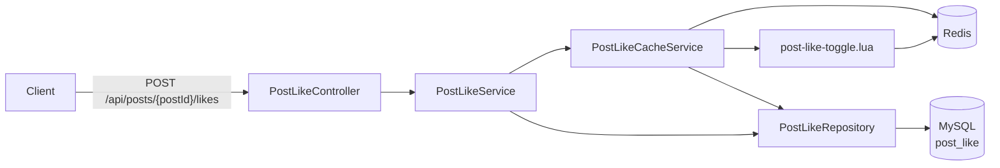

주요 파일:

| 역할 | 파일 |
| --- | --- |
| 좋아요 API | `postlike/controller/PostLikeController.java` |
| 좋아요 전체 흐름 | `postlike/service/PostLikeService.java` |
| Redis Key 및 Bootstrap | `postlike/service/PostLikeCacheService.java` |
| DB 조회 | `postlike/repository/PostLikeRepository.java` |
| Redis 토글 | `resources/scripts/post-like-toggle.lua` |
| Lua Script Bean 등록 | `global/config/RedisConfig.java` |

---

## 4. Redis Key 구조

게시글마다 최대 3종류의 Key를 사용한다.

| Key | 자료형 | 의미 | 현재 TTL |
| --- | --- | --- | --- |
| `post:likes:{postId}` | Set | 좋아요를 누른 회원 ID 집합 | 없음 |
| `post:likes:{postId}:init` | String | DB 데이터를 Redis에 적재 완료했다는 표시 | 없음 |
| `post:likes:{postId}:lock` | String | 현재 다른 요청이 Bootstrap 중이라는 표시 | 10초 |

예시:

```text
post:likes:10       = {1, 3, 7}
post:likes:10:init  = "1"
```

정상적으로 Bootstrap이 끝난 뒤에는 `lock` Key가 삭제된다.

```text
post:likes:10:lock  = 존재하지 않음
```

### `initKey`와 `lockKey`를 분리한 이유

두 Key의 의미는 다르다.

```text
initKey = 과거에 Bootstrap이 정상적으로 끝났는가?
lockKey = 지금 이 순간 누군가 Bootstrap을 수행 중인가?
```

`lockKey`는 작업 중에만 필요하다. 정상 완료 후 즉시 삭제해도 `initKey`가 남아 있으므로
다음 요청에서 Bootstrap을 다시 하지 않는다.

---

## 5. Bootstrap이란 무엇인가

Redis는 캐시이므로 서버 재시작, Redis 재시작, Key 삭제 등의 이유로 데이터가 비어 있을 수 있다.
DB에는 기존 좋아요 데이터가 있지만 Redis Set이 비어 있는 상태에서 바로 토글하면 잘못된 결과가 나온다.

예를 들어 DB에는 이미 회원 1의 좋아요가 존재하지만 Redis가 비어 있다고 가정한다.

```text
DB post_like       = {(postId=10, memberId=1)}
Redis post:likes:10 = 없음
```

이 상태에서 Redis만 보고 토글하면 회원 1이 좋아요를 누르지 않았다고 오해한다.

Bootstrap은 이 문제를 막기 위해 DB의 회원 ID 목록을 Redis Set으로 다시 적재하는 작업이다.

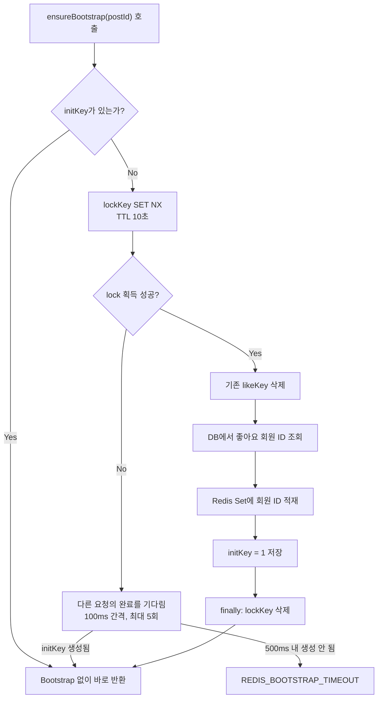

### 좋아요가 0개인 게시글도 `initKey`가 필요한 이유

Redis에서 빈 Set은 Key 자체가 없는 상태와 구분하기 어렵다.

```text
게시글에 좋아요가 0개라서 Set이 없음
Redis가 초기화되어 Set이 없음
```

두 상황을 구분하기 위해 좋아요가 0개여도 Bootstrap이 끝났다면 `initKey`를 저장한다.

---

## 6. 최초 좋아요 요청 흐름

Redis가 비어 있는 상태에서 회원 7이 게시글 10의 좋아요 버튼을 누른 상황이다.

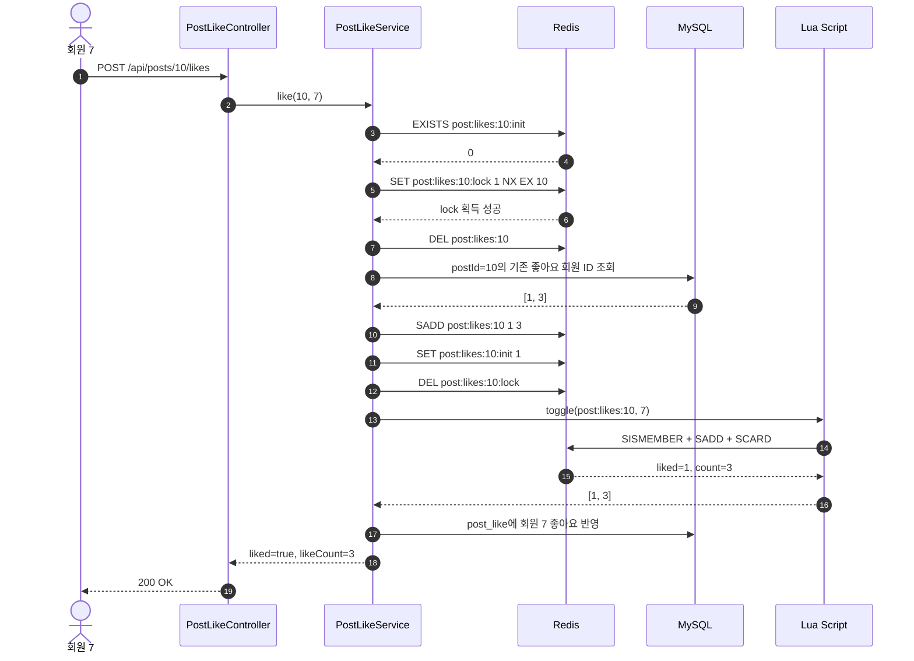

Bootstrap은 모든 게시글을 서버 시작 시 한 번에 적재하는 작업이 아니다.
해당 게시글에 Redis 접근이 처음 발생했을 때 게시글 단위로 수행한다.

---

## 7. 이미 Bootstrap된 게시글의 좋아요 요청

`initKey`가 이미 있다면 DB 회원 목록 조회는 생략한다.

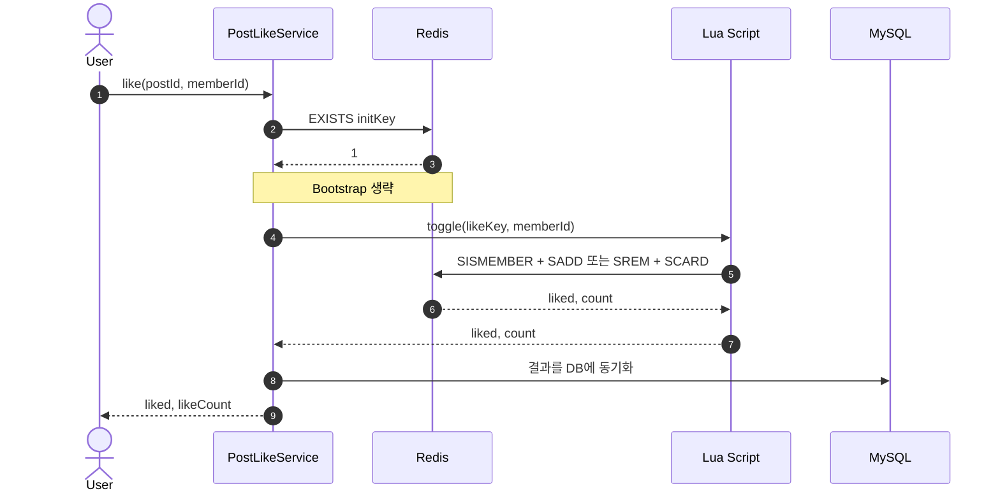

---

## 8. Lua Script가 필요한 이유

좋아요 토글은 다음 두 단계로 구성된다.

```text
1. 회원 ID가 Set에 있는지 확인
2. 있으면 삭제, 없으면 추가
```

애플리케이션에서 두 Redis 명령을 따로 실행하면 동시에 들어온 요청이 같은 상태를 읽을 수 있다.

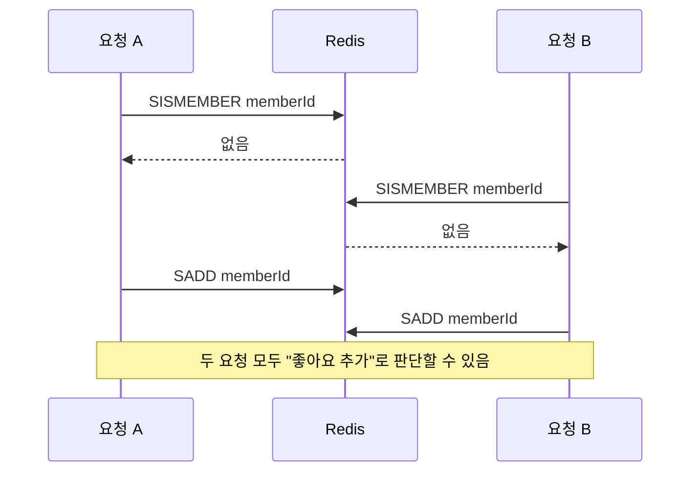

현재 코드는 Lua Script 내부에서 확인과 변경을 한 번에 실행한다.

```lua
if redis.call('SISMEMBER', key, member) == 1 then
    redis.call('SREM', key, member)
    return {0, redis.call('SCARD', key)}
else
    redis.call('SADD', key, member)
    return {1, redis.call('SCARD', key)}
end
```

Redis는 Lua Script 실행 중 다른 명령을 끼워 넣지 않으므로 토글이 원자적으로 처리된다.

---

## 9. 동시에 Bootstrap 요청이 들어오면 어떻게 되는가

Redis가 비어 있는 게시글에 요청 A와 B가 거의 동시에 들어올 수 있다.

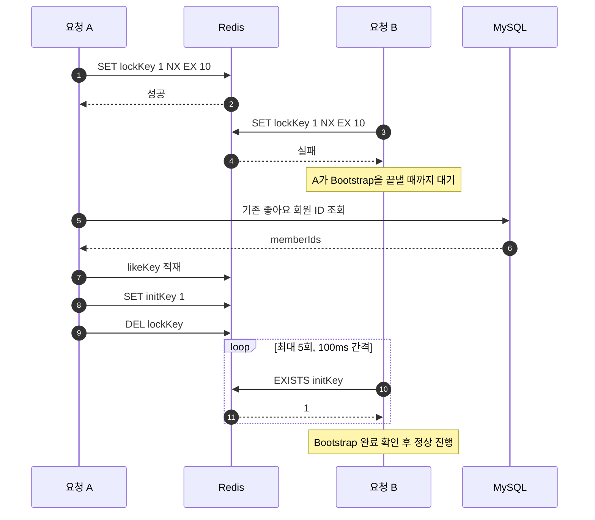

현재 설정:

```text
lockKey TTL       = 10초
다른 요청 대기 시간 = 최대 500ms (100ms * 5회)
```

`lockKey` TTL 10초는 좋아요 데이터를 만료시키기 위한 값이 아니다.
Bootstrap 도중 애플리케이션이 종료되어 `finally`가 실행되지 않는 경우
lock이 영구적으로 남지 않게 하는 안전장치다.

---

## 10. Redis 반영 후 DB 저장에 실패하면 어떻게 되는가

현재 토글 순서는 Redis 먼저, DB 나중이다.

```text
Redis Lua 토글
-> DB 동기화
```

DB 저장에 실패하면 Redis 상태만 변경된 채로 남을 수 있다. 이를 막기 위해 Redis 변경을 되돌린다.

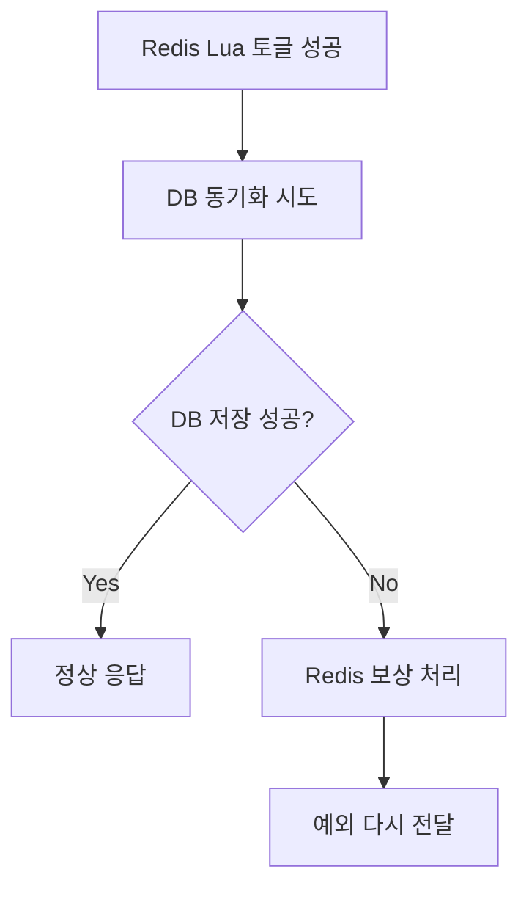

보상 규칙:

| Redis 토글 결과 | DB 저장 실패 시 보상 |
| --- | --- |
| 좋아요 추가됨 | Redis Set에서 회원 ID 제거 |
| 좋아요 취소됨 | Redis Set에 회원 ID 다시 추가 |

---

## 11. Redis가 꺼져 있으면 어떻게 되는가

Redis 연결에 실패하면 DB만 사용해 좋아요를 처리한다.

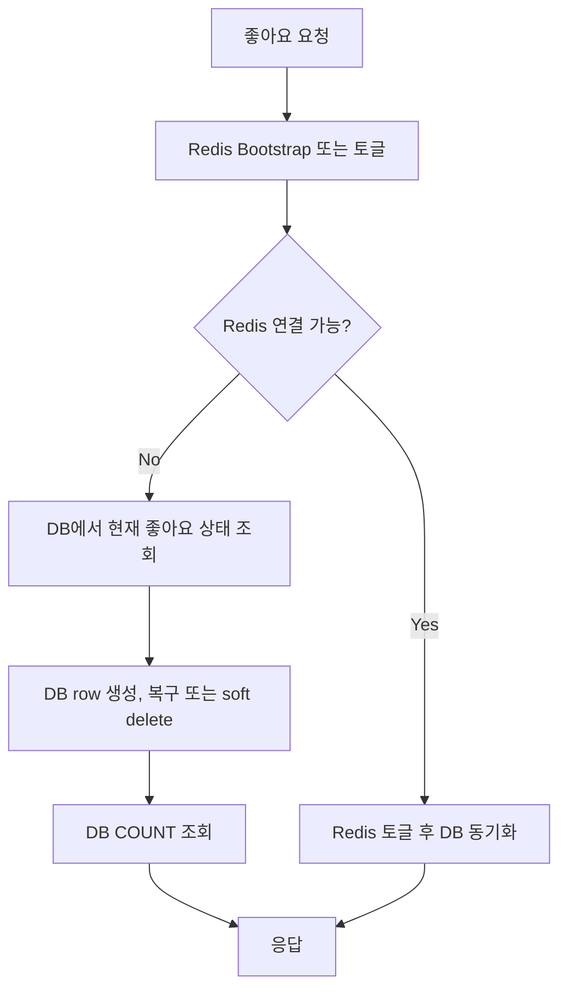

조회도 같은 원칙을 따른다.

| 기능 | Redis 정상 | Redis 연결 실패 |
| --- | --- | --- |
| 내가 좋아요를 눌렀는지 확인 | `SISMEMBER` | DB `exists` 조회 |
| 좋아요 수 조회 | `SCARD` | DB `COUNT` 조회 |

---

## 12. 게시글 조회 시 실제로 발생하는 일

중요한 점: 현재 코드는 좋아요 버튼을 누를 때만 Bootstrap하지 않는다.

`PostService`는 게시글 응답에 좋아요 수를 포함하기 위해 `likeCount()`를 호출한다.

```java
postLikeCacheService.likeCount(p.getId())
```

`likeCount()` 내부에서도 `ensureBootstrap()`을 호출한다.

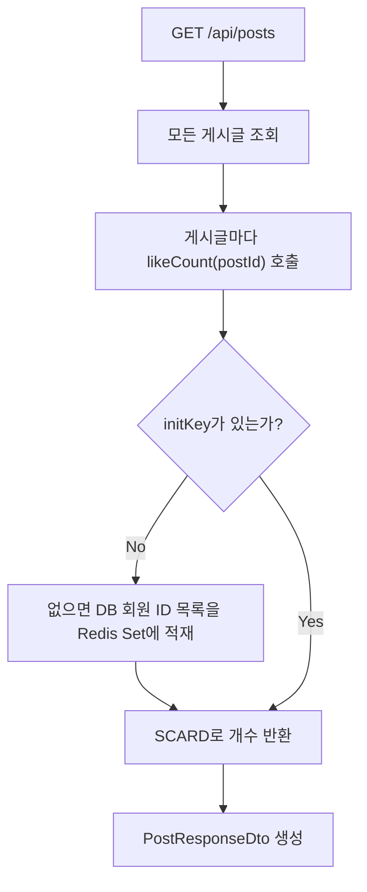

### 현재 구조의 최악 상황

`GET /api/posts`에 페이지네이션이 없고 Redis가 비어 있다면, 목록 조회 한 번으로 모든 게시글이
순차적으로 Bootstrap될 수 있다.

```text
게시글 1 -> DB 회원 ID 조회 -> Redis 적재
게시글 2 -> DB 회원 ID 조회 -> Redis 적재
게시글 3 -> DB 회원 ID 조회 -> Redis 적재
...
```

문제:

1. 게시글 수만큼 추가 DB 조회가 발생한다.
2. 좋아요 개수만 표시하기 위해 회원 ID 전체를 Redis에 적재한다.
3. 오래된 게시글 Key도 Redis 메모리에 계속 누적될 수 있다.

---

## 13. TTL의 현재 상태와 개선 필요성

### 현재 상태

```text
likeKey TTL = 없음
initKey TTL = 없음
lockKey TTL = 10초
```

`spring.data.redis.timeout=200ms`는 TTL이 아니다. Redis 응답을 기다리는 통신 timeout이다.

### 왜 운영 환경에서는 TTL을 고려해야 하는가

현재는 한 번 Bootstrap된 게시글의 `likeKey`와 `initKey`가 자동으로 삭제되지 않는다.
게시글이 계속 쌓이면 Redis가 오래된 게시글의 좋아요 Set까지 계속 들고 있을 수 있다.

### TTL을 추가할 때 주의할 점

`likeKey`만 만료시키면 안 된다.

```text
likeKey 삭제
initKey 유지
-> 다음 요청은 Bootstrap 완료 상태라고 착각
-> 빈 Set을 정상 데이터로 읽음
```

`likeKey`와 `initKey`의 생명주기를 함께 관리해야 한다.

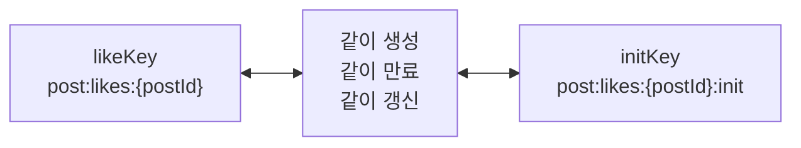

---

## 14. DB는 왜 계속 필요한가

Redis가 토글을 처리하지만 DB가 원본이다.

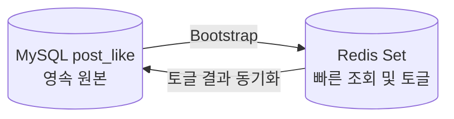

DB를 유지하는 이유:

1. Redis 재시작 후 데이터를 복원할 수 있다.
2. Redis 장애 시 DB fallback이 가능하다.
3. `post_like(post_id, member_id)` unique constraint가 중복 데이터의 최종 방어선이다.
4. Redis 메모리 정책에 따라 Key가 사라져도 영속 데이터를 잃지 않는다.

---

## 15. 현재 코드에서 개선이 필요한 부분

아래 항목은 현재 구현을 이해할 때 반드시 같이 공유해야 한다.

### 15.1 목록 조회에서 전체 Bootstrap 가능

현재 `GET /api/posts`는 모든 게시글을 조회하고 각 게시글마다 `likeCount()`를 호출한다.

개선 방향:

```text
목록 조회
-> 페이지네이션 적용
-> DB 집계 조회 또는 별도 count 캐시 사용
-> Redis Set Bootstrap은 실제 좋아요 토글 중심으로 제한
```

### 15.2 `likeKey`와 `initKey`에 TTL 없음

오래된 게시글의 캐시가 계속 남을 수 있다.

개선 방향:

```text
likeKey와 initKey에 동일한 TTL 적용
-> 활성 게시글 접근 시 두 Key TTL 함께 갱신
-> Redis maxmemory 및 eviction 정책 설정
```

### 15.3 좋아요 API가 클라이언트의 `memberId`를 신뢰

현재 API:

```text
POST /api/posts/{postId}/likes?memberId=1
```

클라이언트가 다른 회원 ID를 보내면 타인의 좋아요 상태를 변경할 수 있다.

개선 방향:

```text
@RequestParam memberId 제거
-> 기존 @LoginMember MemberDto 사용
-> JWT에서 로그인 회원 ID 추출
```

### 15.4 `/api/posts/**` 전체가 JWT Filter whitelist

현재 `JwtFilter`는 `/api/posts/**`를 인증 없이 통과시킨다.
게시글 조회 `GET`은 공개할 수 있지만 좋아요, 생성, 수정, 삭제는 인증이 필요하다.

개선 방향:

```text
GET /api/posts             공개
GET /api/posts/{postId}    공개
POST /api/posts            인증 필요
PATCH /api/posts/{postId}  인증 + 작성자 검증
DELETE /api/posts/{postId} 인증 + 작성자 검증
POST /api/posts/{postId}/likes 인증 필요
```

### 15.5 Bootstrap 대기 시간과 lock TTL은 초기 기준값

현재 값:

```text
다른 요청 대기 = 최대 500ms
lock TTL       = 10초
```

좋아요가 매우 많은 게시글은 Bootstrap에 500ms 이상 걸릴 수 있다.
실제 운영 데이터로 시간을 측정한 뒤 값을 조정해야 한다.

---

## 16. 개선 우선순위

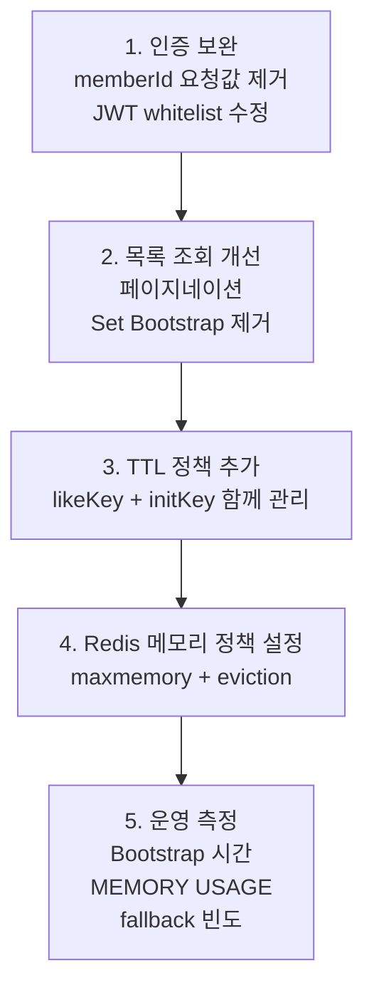

---

## 17. 팀원에게 1분 안에 설명하기

```text
현재 구현은 Redis에 좋아요 개수만 저장하는 방식이 아닙니다.
게시글마다 좋아요를 누른 회원 ID를 Set으로 저장합니다.

Redis가 비어 있으면 해당 게시글의 기존 좋아요 데이터를 DB에서 읽어서
Set을 먼저 만들고, 이후 Lua Script로 좋아요 추가와 취소를 원자적으로 처리합니다.
DB는 계속 원본으로 유지하고 Redis 장애 시에는 DB만 사용합니다.

다만 현재는 목록 조회에서도 Bootstrap이 발생하고,
좋아요 Set과 initKey에 TTL이 없어서 오래된 캐시가 누적될 수 있습니다.
그래서 인증 보완, 목록 조회 분리, TTL 정책 추가가 다음 개선 과제입니다.
```

---

## 18. 자주 나오는 질문

### Q. Redis가 모든 게시글의 좋아요를 항상 들고 있는가?

처음부터 전체 게시글을 한 번에 적재하지는 않는다. 요청이 들어온 게시글부터 Lazy Bootstrap한다.
하지만 현재 목록 조회가 모든 게시글의 `likeCount()`를 호출하므로, 목록 조회 한 번으로 전체 게시글이
Bootstrap될 가능성은 있다.

### Q. 게시글을 볼 때마다 Bootstrap하는가?

아니다. `initKey`가 없는 게시글은 최초 1회 Bootstrap한다. 이후에는 `initKey`를 보고 생략한다.

### Q. `lockKey`를 삭제하면 다음 요청에서 다시 Bootstrap하는가?

아니다. 완료 여부는 `initKey`가 관리한다. `lockKey`는 작업 중에만 사용하는 임시 Key다.

### Q. TTL 10초는 좋아요 Set의 만료 시간인가?

아니다. `lockKey`가 비정상 상황에서 영구적으로 남지 않도록 설정한 TTL이다.

### Q. 좋아요 Set에도 TTL이 필요한가?

소규모 프로젝트에서는 당장 문제가 없을 수 있지만, 운영 환경에서는 고려해야 한다.
단, `likeKey`와 `initKey`에 동일한 정책을 적용해야 한다.

### Q. Redis가 꺼지면 좋아요 기능도 멈추는가?

아니다. Redis 연결 실패를 감지하면 DB fallback 경로로 토글과 조회를 처리한다.

